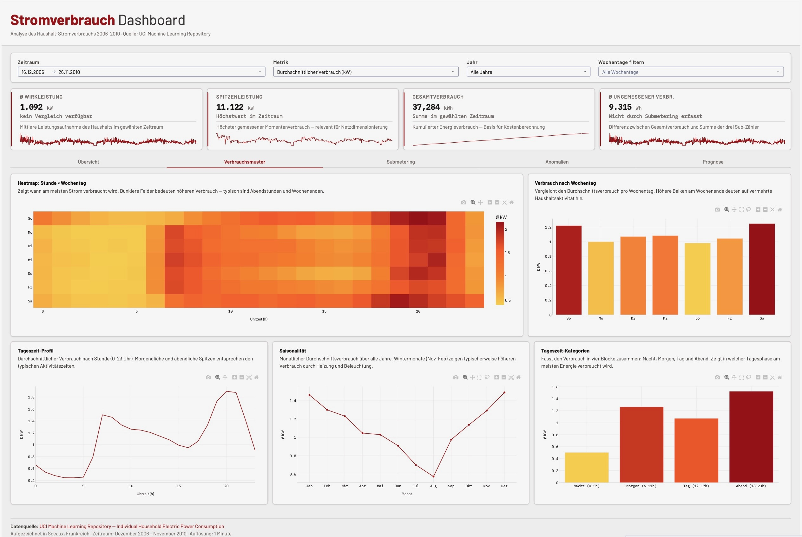
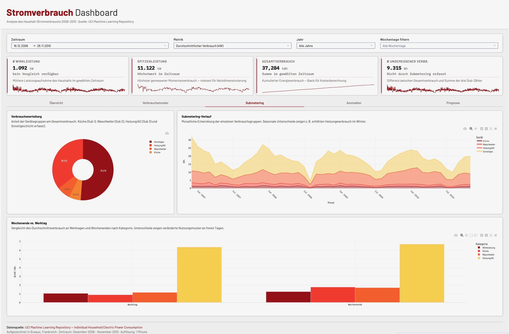

# Household-Electric-Power-Consumption-Dashboard

This project was created as an University assigment at THWS. It is an interactive dashboard for analyzing household electricity consumption data from 2006 to 2010, built with Python and Dash.
The Data is connected and saved in a local postgresql DB.

 

## Overview

The dashboard visualizes over 2 million minute-level electricity readings from a single household in Sceaux, France. It enables interactive exploration of consumption patterns, peak loads, submetering breakdowns, and anomalies, all filterable by time period, metric, year, and weekday.

## Dataset

**Source:** [UCI Machine Learning Repository – Individual Household Electric Power Consumption](https://archive.ics.uci.edu/dataset/235/individual+household+electric+power+consumption)

## Technologies Used

Data Processing: Python, Pandas, NumPy, PostgreSQL
Visualization: Dash, Plotly
Styling: Dash Bootstrap Components
Version Control: Git, GitHub

